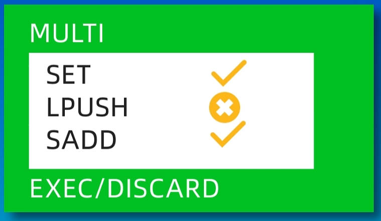

Redis 事务

Redis 支持事务，也就是说可以在一次请求中，执行多个命令。

Redis 中的事务，主要是用过 MULTI 和 EXEC 这两个命令来实现的。

MULTI 命令，用来开启一个事务，事务开启之后，所有的命令就会被放入到一个队列中。通过 EXEC 命令，来执行队列中的所有命令。

- 在发送 EXEC 命令之前，所有的命令，都会放入一个队列中缓存起来，不会立即执行。
- 在收到 EXEC 命令之后，事务开始执行。事务中任何一个命令执行失败，其他命令依然会被执行。
- 在事务执行的过程中，其它客户端提交的命令请求，并不会被插入到事务的执行命令序列中。

在关系型数据库中，事务一般是一个原子操作，要么全部执行成功，要么全部执行失败。

在 Redis 中，事务不会保证所有命令都会执行成功，它的执行结果，取决于事务中的命令。

