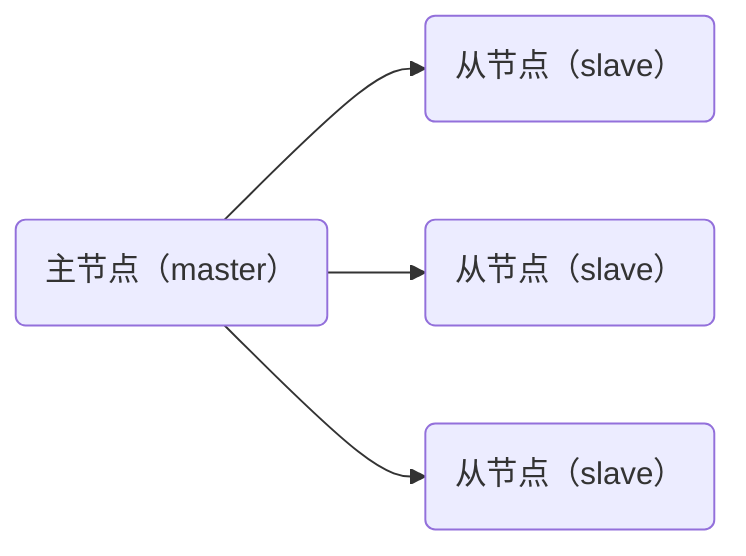

# Redis 主从复制

主从复制，是指将一台 Redis 服务器（主节点）的数据，复制到其它 Redis 服务器（从节点）。

一个主节点可以有多个从节点，而每个从节点只能有一个主节点。

数据的复制是单向的，只能由主节点到从节点。

一般来说，主节点负责写操作，从节点负责读操作。

主节点会将自己的数据变化，通过异步的方式，发送给从节点。从节点接收到主节点的数据之后，更新自己的数据。这样就达到了数据一直的目的。



主节点不需要修改任何配置，因为默认的配置就是主节点。只需要修改从节点的配置就可以了。

修改的方式有两种：

- 方式一：命令行配置。
- 方式二：配置文件

## 一、命令行配置

查看当前节点角色，执行命令

```bash
> role
1) "master"
2) (integer) 0
3) (empty array)
```

配置所属主节点（不是很常用，了解即可）

```bash
replicaof [host] [port]

slaveof [host] [port] #（旧版）
```

## 二、配置文件配置

下面就来配置一下主从复制：

Redis 的配置文件是 `/etc/redis/redis.conf`，把该文件复制一份到根目录，作为主节点的配置文件。

```bash
cp /etc/redis/redis.conf /redis.conf
```

来到根目录，复制一个 `redis-6380.conf` 文件，作为从节点的配置文件：

```bash
cp redis.conf redis-6380.conf
```

- 6380 就是要使用的从节点的端口号。

打开 `redis-6380.conf` 配置文件，

找到 `port`，`pidfile` 进行配置：

```shell
# port 6379
port 6380

...

# pidfile /run/redis/redis-server.pid
pidfile /run/redis/redis_6380.pid
```

- Redis 是以守护进程的方式运行，系统默认会把 pid 写入到这个文件里面。
- 因为这里我们要启动多个 Redis 服务，所以要把 pid 文件区分开，

再找到 `dbfilename` 配置项，进行设置：

```shell
# dbfilename dump.rdb
dbfilename dump-6380.rdb
```

- 它配置了持久化文件，当执行 save 或者 bgsave 命令时，就会把内存中的数据，保存到这个文件里面。
- 为了区分开主节点和从节点的数据，也要为这个文件加上端口号。

再找到 `replicaof` 配置项，它用来指定主节点。默认是注释掉的。进行配置：

```shell
# replicaof <masterip> <masterport>
replicaof 127.0.0.1 6379
```

- 表示该节点是 6379 端口 redis 服务的从节点。

这样就配置好了，保存 redis-6380.conf 文件。

打开一个新的终端，启动 redis-6380 服务。

```shell
redis-server redis-6380.conf
```

再打开一个新的客户端，连接这个 redis-6380 服务：

```shell
redis-cli -p 6380
```

连接成功后，使用 info replication 命令，来查看一下信息。

```bash
127.0.0.1:6380> info replication
# Replication
role:slave
master_host:127.0.0.1
master_port:6379
master_link_status:up
master_last_io_seconds_ago:1
master_sync_in_progress:0
slave_read_repl_offset:28
slave_repl_offset:28
slave_priority:100
slave_read_only:1
replica_announced:1
connected_slaves:0
master_failover_state:no-failover
master_replid:7e829a30fa201dbb9caf35e3d72674cf157d8739
master_replid2:0000000000000000000000000000000000000000
master_repl_offset:28
second_repl_offset:-1
repl_backlog_active:1
repl_backlog_size:1048576
repl_backlog_first_byte_offset:15
repl_backlog_histlen:14
```

- 可以看到，这个从节点的角色是 slave，表示这个节点是一个从节点。对应的主节点端口号是 6379。这就表示主从配置成功了。

再打开一个终端，连接 redis 主节点：

```shell
redis-cli
```

查看其中的 KEYS：

```shell
127.0.0.1:6379> KEYS *
1) "k1"
2) "k4"
```

再在从节点的客户端，查看其中的 KEYS

```bash
127.0.0.1:6380> KEYS *
1) "k4"
2) "k1"
```

- 可以看到，从节点的数据，和主节点的是一样的。

在主节点添加一个新的键值对，在从节点查看，它也被添加进来了。

主节点的数据变化，会自动同步到从节点上。

这就是主从复制的简单演示。当然，从从节点也可以配置多个，只要修改相应的端口即可。

> 关闭 Redis 服务，在 redis-cli 客户端中，执行 SHUTDOWN 命令，
>
> ```shell
> 127.0.0.1:6380> SHUTDOWN
> not connected> exit
> ```
>
